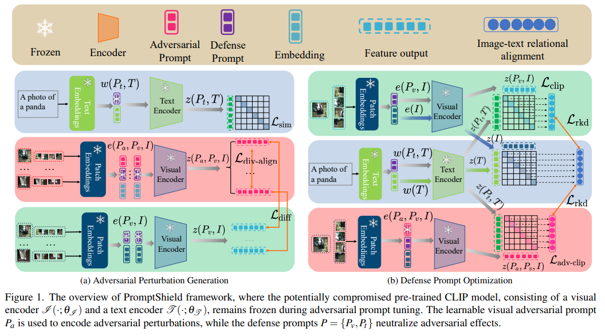

# PromptShield 
> **PromptShield: Adversarial Prompt Tuning against Backdoor Attacks in Vision-Language Models**<br>
>
<h1 align="center"></h1>


## Overview

This repository contains the supplementary code for the paper "PromptShield: Adversarial Prompt Tuning against Backdoor Attacks in Vision-Language Models".

PromptShield introduces a novel backdoor purification framework based on adversarial prompt tuning, designed to provide universal, transferable, and efficient defense for multimodal models in real world deployment. PromptShield is the first framework to demonstrate robust defense across various attacks and datasets while supporting prompt-free deployment, oneering a "one training, multiple deployments" paradigm. It requires only a single training phase to enable deployment across different attacks and datasets without additional fine-tuning. 


## Environment Setup


### Requirements

- Operating System: Linux 

- Python Version: Python ≥ 3.9 (64-bit)

- GPU: CUDA-compatible GPU (tested on NVIDIA A100 and RTX 3090)

- Frameworks: PyTorch ≥ 1.13.0, torchvision ≥ 0.14.0


### Setup via Conda (Recommended)

We recommend using Anaconda for a consistent environment setup.

```bash
# Create a new conda environment from the provided YAML file
conda env create --prefix ./env -f environment.yml

# Activate the environment
source activate ./env

```
### Setup via pip
If Conda is not available, you can directly install dependencies with pip:
```bash
pip install -r requirements.txt
```

## Usage

### Adversarial Prompt Tuning
Run the following command to train and evaluate PromptShield against a specific backdoor attack:
```
python test_PromptShield.py --subtask "adv_prompt_tuing" --attack "BadNets" --test_dataset "ImageNet1K"
```
This experiment fine-tunes the learnable prompts using adversarial optimization under the specified attack scenario.

### Test Transferability
Evaluate PromptShield’s ability to transfer protection across different datasets and attack types:
```
python test_PromptShield.py --subtask "cross-task_transferability" --src_dataset "ImageNet1K" --target_attack "BadCLIP" --target_dataset "CIFAR-100"
```

### Prompt-free Inference via Relational Knowledge Distillation
Test PromptShield’s prompt-free variant, where distilled models perform inference without prompts
```
python test_PromptShield.py --subtask "distillation" --src_attack "BadNets" --src_dataset "ImageNet1K" --target_attack "BadCLIP" --target_dataset "CIFAR-100"
```


